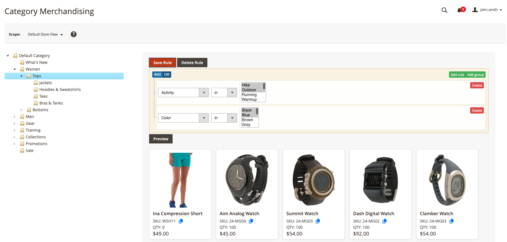
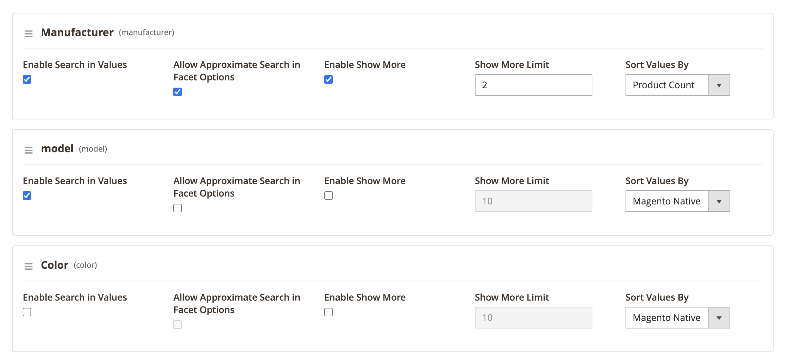

# 
Meilisearch / Magento 2 (Adobe Commerce)

    
    

    
    
    &nbsp;&nbsp;&nbsp;&nbsp;
    
    

The Meilisearch extension for Magento 2 enables replacing Magento's default search engine (OpenSearch) with Meilisearch.

## 🔎 What is Meilisearch?

Meilisearch is a search engine featuring a blazing fast RESTful search API, typo tolerance, comprehensive language support, and much more.

## 🧩 Breeze Compatibility

This frontend is fully compatible with the [Breeze frontend](https://breezefront.com/) by SwissUp.  
If you're using Breeze, make sure to install the dedicated compatibility module:  
👉 [Meilisearch Breeze Compatibility Module](https://github.com/walkwizus/magento2-module-breeze-meilisearch)

## ✨ Main Features

### 🗂️ Category Merchandising

The **Category Merchandising** feature allows you to dynamically populate your categories using a rule engine.  
No more manual category management — products are automatically assigned in real time based on the rules you define.

You retain full control with an intuitive **drag-and-drop** interface to reorder products and highlight your **top-performing items**.

  

### 🧩 Facet Merchandising

The **Facet Merchandising** feature lets you fully customize the display of layered navigation filters for an optimized user experience.  
You can:

- 🔃 Reorder facets as needed
- 🔍 Enable a search field within facet options
- ➕ Limit the number of visible options with a **“Show more”** toggle

Perfect for keeping navigation **clean and user-friendly**, even in **attribute-rich catalogs**.

  

### 🖥️ Faceted Frontend Experience

The module offers a **fully dynamic and responsive frontend interface** powered by Knockout.js, designed to enhance layered navigation usability and speed.

Key features include:

- 🎚️ **Price slider** with real-time filtering
- ☑️ **Multi-select checkboxes** for flexible attribute filtering
- 🔍 **Search within facet options** to quickly find relevant values
- ⚡ Instant UI updates without page reloads

This modern frontend ensures a smooth and engaging shopping experience, even on large catalogs.

---

    <b>📚 Documentation &nbsp;&nbsp; | &nbsp;&nbsp; 🚀 Live Demo</b>

    
    &nbsp;&nbsp;&nbsp;&nbsp;
    

    <a href="https://walkwizus.github.io/magento2-module-meilisearch-docs/" target="_blank">View the full documentation</a> &nbsp;&middot;&nbsp; 
    <a href="https://demo-meilisearch.walkwizus.com/" target="_blank">Try the live demo</a>

